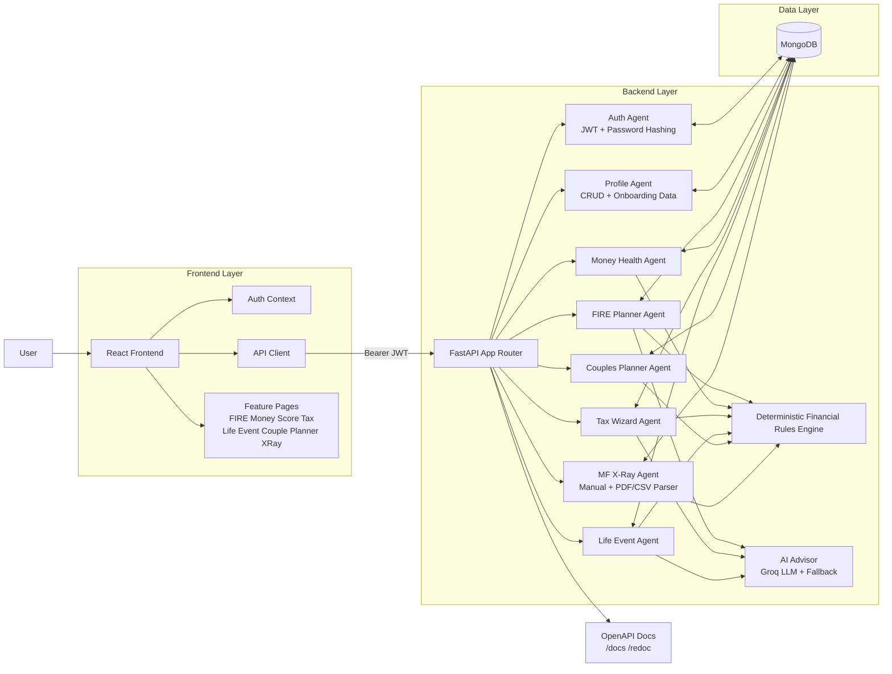
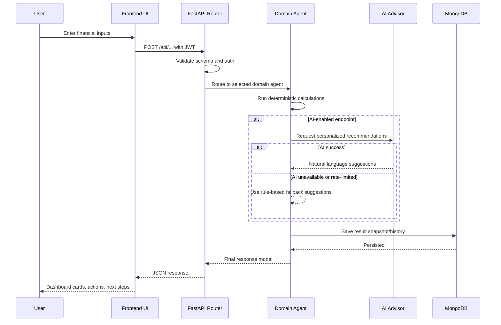

# Money Mentor

AI-powered personal finance platform for Indian users.

This monorepo contains:
- `backend/`: FastAPI + MongoDB + JWT auth + financial calculators + optional Groq AI advice
- `frontend/`: React (Vite) SPA with tools for FIRE planning, money health score, tax optimization, portfolio x-ray, life-event advice, and couple planning

## Features

- Authentication (register/login/me)
- Financial profile create/read/update
- FIRE path projection and recommendations
- Money health score across core dimensions
- Tax optimization (old vs new regime)
- Portfolio X-Ray (manual + CSV/PDF upload)
- Life-event advisor
- Couple financial optimizer

## Tech Stack

- Backend: FastAPI, Uvicorn, Motor/PyMongo, Pydantic, JWT, Passlib/Bcrypt, optional Groq API
- Frontend: React 19, React Router 7, Vite 8, Tailwind CSS
- Database: MongoDB

## Project Structure

```text
money_mentor/
├── backend/
│   ├── app.py
│   ├── auth.py
│   ├── database.py
│   ├── models.py
│   ├── services.py
│   ├── ai_advisor.py
│   ├── requirements.txt
│   └── README.md
├── frontend/
│   ├── package.json
│   ├── src/
│   │   ├── api/
│   │   ├── components/
│   │   ├── context/
│   │   └── pages/
│   └── README.md
└── README.md
```

## Architecture Document

The platform uses a frontend orchestrator plus domain-specific backend service agents. The frontend collects user intent and input, then calls API endpoints. The backend validates input, runs deterministic calculators, optionally augments results with AI suggestions, persists history, and returns a response designed for dashboard rendering.

### 1) System Architecture Diagram



### 2) Request-Response and Agent Communication



### 3) Agent Roles

- Auth Agent: registration, login, token issuance, identity resolution for protected endpoints.
- Profile Agent: onboarding profile create/read/update for all downstream planning features.
- FIRE Planner Agent: retirement corpus projection, SIP requirement, status, and monthly breakdown.
- Money Health Agent: six-dimensional financial wellness scoring and recommendations.
- Tax Wizard Agent: tax regime comparison, deduction discovery, tax-saving opportunities.
- Life Event Agent: event-specific allocation strategy and prioritized actions.
- Couples Planner Agent: dual-income optimization for SIP, insurance, and retirement goals.
- MF X-Ray Agent: portfolio analysis from manual holdings or uploaded PDF/CSV statement parsing.
- AI Advisor Agent: recommendation generation for FIRE, Tax, and Life Event features, with fallback behavior.

### 4) Tool Integrations

- MongoDB: user, profile, score history, tax calculations, x-ray analyses, and advisory logs.
- Groq API: optional LLM recommendations when API key is configured.
- File ingestion: PDF and CSV statement parsing for MF X-Ray upload flow.
- OpenAPI docs: contract testing and integration support through Swagger/ReDoc.

### 5) Error Handling Logic

- Input validation errors: rejected early by Pydantic request models with descriptive messages.
- Auth failures: 401 for missing/invalid/expired token.
- Domain errors: 400 for invalid financial input combinations or parsing failures.
- AI provider failures: graceful fallback to deterministic recommendations.
- File parsing failures: clear 400 messages for unsupported or unreadable statement uploads.
- Global API error format: structured JSON error payload for frontend-safe rendering.

### 6) Reliability and Security Notes

- JWT-based route protection for all user-specific operations.
- Password hashing via bcrypt-based passlib context.
- Isolated user data access using authenticated user id.
- Startup and shutdown hooks for database lifecycle management.
- CORS enabled for web client integration; tighten origins in production.

## Prerequisites

- Python 3.9+
- Node.js 18+
- npm
- MongoDB (local or Atlas)

## Quick Start (Local Development)

### 1) Clone and enter project

```bash
git clone <your-repo-url>
cd money_mentor
```

### 2) Start backend

```bash
cd backend
python -m venv .venv
```

Activate environment:

Windows (PowerShell):
```powershell
.\.venv\Scripts\Activate.ps1
```

macOS/Linux:
```bash
source .venv/bin/activate
```

Install dependencies and run:

```bash
pip install -r requirements.txt
python app.py
```

Backend runs at:
- `http://localhost:8000`
- Swagger docs: `http://localhost:8000/docs`
- ReDoc: `http://localhost:8000/redoc`

### 3) Configure backend environment variables

Create `backend/.env`:

```env
MONGODB_URL=mongodb://localhost:27017
DATABASE_NAME=money_mentor
SECRET_KEY=change-this-in-production
ALGORITHM=HS256
ACCESS_TOKEN_EXPIRE_MINUTES=1440
PORT=8000
HOST=0.0.0.0
DEBUG=True

# Optional AI features
GROQ_API_KEY=
GROQ_MODEL=mixtral-8x7b-32768
```

### 4) Start frontend

Open a second terminal:

```bash
cd frontend
npm install
```

Create `frontend/.env`:

```env
VITE_API_URL=http://localhost:8000/api
```

Run frontend:

```bash
npm run dev
```

Frontend runs at:
- `http://localhost:5173`

## Important Integration Note

The frontend fallback API URL is `http://localhost:8000/api`, and the backend is now configured to use port `8000` by default.

Set `VITE_API_URL=http://localhost:8000/api` in `frontend/.env` to keep it explicit across environments.

## Backend API Overview

Authentication:
- `POST /api/auth/register`
- `POST /api/auth/login`
- `GET /api/auth/me`

Profile:
- `POST /api/profile`
- `GET /api/profile`
- `PUT /api/profile`

Calculators and advisors:
- `POST /api/calculate/fire`
- `POST /api/calculate/money-score`
- `GET /api/money-score/history`
- `POST /api/calculate/tax`
- `POST /api/portfolio/xray`
- `POST /api/portfolio/xray/upload`
- `POST /api/life-event/advice`
- `POST /api/couple-planner/optimize`

Utility:
- `GET /api/health`
- `GET /`

## Frontend Routes

- `/` Home
- `/login`
- `/form`
- `/dashboard`
- `/fire-planner`
- `/money-score`
- `/tax-wizard`
- `/mf-xray`
- `/life-event`
- `/couple-planner`
- `/articles`
- `/api-test`

## Running with Existing Helper Scripts

From `backend/`:

Windows:
```bat
quickstart.bat
```

macOS/Linux:
```bash
./quickstart.sh
```

## Common Issues

- MongoDB connection errors:
  - Ensure MongoDB is running locally, or use a valid Atlas URI in `MONGODB_URL`.
- Unauthorized (401) from protected APIs:
  - Re-login and ensure `Authorization: Bearer <token>` is sent.
- Frontend cannot reach backend:
  - Verify `frontend/.env` has `VITE_API_URL=http://localhost:8000/api`.
- Groq API failures/rate limits:
  - Set a valid `GROQ_API_KEY`. The app can fall back to rule-based suggestions for some features.

## Build Commands

Frontend:

```bash
cd frontend
npm run build
npm run preview
npm run lint
```

Backend (dev run):

```bash
cd backend
python app.py
# or
uvicorn app:app --reload --host 0.0.0.0 --port 8000
```

## Notes for Production

- Restrict CORS to trusted origins (backend currently allows all origins).
- Use strong `SECRET_KEY` and secure secret management.
- Set `DEBUG=False`.
- Use managed MongoDB with proper access controls and backups.
- Run backend behind a production ASGI server/reverse proxy.

## License

Add your preferred license information here.
